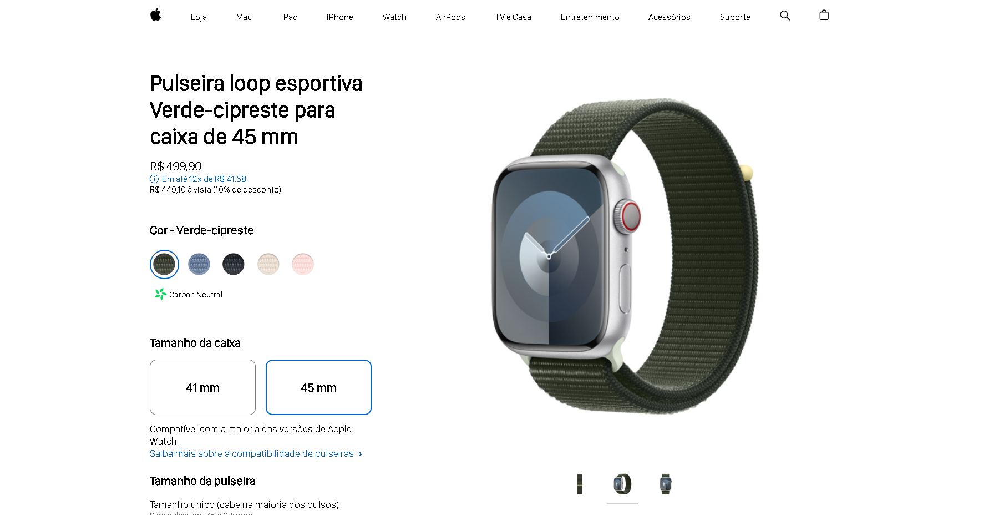

# AppleWatch

<h1 align="center">AppleWatch - FrontEnd</h1>

Página web integrada com JavaScript voltado ao FrontEnd. Utiliza-se de metodologias de programação de objetos, arrays (listas), classes, seleção de dados de um objeto, seleção da posição de um elemento de array (lista), funções que trabalham com as variáveis, listas e objetos em ordem de cascata lógica, etc.

Este projeto consistiu na cópia do FrontEnd estático de uma página da Apple, e nela desenvolver do zero, a mesma metodologia de "dar vida" à uma página web.

É possível navegar pelas opções de cores, imagens e tamanho de caixa de forma responsiva, em que todas as opções se entrelaçam e imprimem nos títulos e caixas de visualização, aquilo que o usuário espera.

## 🖥️ Tecnologias

  Esse projeto foi desenvolvido com as seguintes tecnologias:

  - HTML e CSS
  - JavaScript
  - Git e github
  - Figma

## 🚀 Projeto

  

<h2 align="center">
  Quer saber um pouco mais sobre meu desevolvimento em programação?
  <button style="background:#4863F7; border-radius: 999px; padding: 10px; margin: 24px 0; border: 2px solid #202020; color: white;">
    <a href="https://joaogiatti.github.io/CurriculoJoaoGiatti.io/">Acesse meu currículo!</a>
  </button>
</h2>

  Com ajuda do intensivão de JavaScript <a href="https://www.hashtagtreinamentos.com/cursos-hashtag-programacao?origemurl=136986055125&gad_source=1&gclid=Cj0KCQiAn-2tBhDVARIsAGmStVlsMwizIxmuLjGWOaj2hBNZWrLo-_alc65Ej4PkYjpR2vhpPisoSd0aAhDuEALw_wcB">Hashtag Programação</a>

